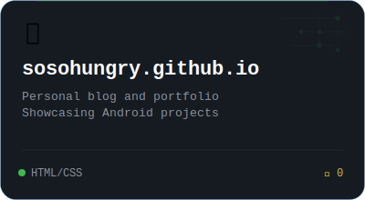
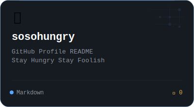

<!-- ============================================ -->
<!-- 🐻 HEADER BANNER                              -->
<!-- ============================================ -->
<div align="center">
  
</div>

<br/>

<!-- ============================================ -->
<!-- 🧊 INTRO                                      -->
<!-- ============================================ -->
<div align="center">

### `> sosohungry@dev ~$ whoami`

**Android Developer · Agent Engineer · IoT Enthusiast**

*"Stay Hungry Stay Foolish"*

I build intelligent mobile applications and autonomous AI agents.

[](https://github.com/sosohungry)
[](https://github.com/sosohungry)

</div>

<!-- ============================================ -->
<!-- 📊 STATS                                      -->
<!-- ============================================ -->

<div align="center">
  
  &nbsp;&nbsp;
  
</div>

<br/>

<div align="center">
  
</div>

<br/>

<!-- ============================================ -->
<!-- 🔥 FEATURED PROJECTS                          -->
<!-- ============================================ -->

<div align="center">

## ⚡ Featured Projects

</div>

<br/>

<div align="center">
<table>
<tr>

<td align="center" width="33%">
<a href="https://github.com/sosohungry/sosohungry.github.io">

</a>
<br/>
<sub><b>📱 sosohungry.github.io</b></sub>
<br/>
<sub>Personal blog and portfolio<br/>Showcasing Android projects</sub>
<br/><br/>


</td>

<td align="center" width="33%">
<a href="https://github.com/sosohungry/sosohungry">

</a>
<br/>
<sub><b>🐙 sosohungry</b></sub>
<br/>
<sub>GitHub Profile README<br/>Stay Hungry Stay Foolish</sub>
<br/><br/>


</td>

</tr>
</table>
</div>

<br/>

<!-- ============================================ -->
<!-- 🛠 TECH STACK                                 -->
<!-- ============================================ -->

<div align="center">

## 🛠 Tech Stack

**Languages**


**Frameworks & Runtime**


**AI & Infrastructure**


</div>

<br/>

<!-- ============================================ -->
<!-- 🐍 CONTRIBUTION SNAKE                         -->
<!-- Requires GitHub Action: Platane/snk           -->
<!-- ============================================ -->

<div align="center">

## 📈 Contribution Graph

<picture>
  <source media="(prefers-color-scheme: dark)" srcset="https://raw.githubusercontent.com/sosohungry/sosohungry/output/github-snake-dark.svg" />
  <source media="(prefers-color-scheme: light)" srcset="https://raw.githubusercontent.com/sosohungry/sosohungry/output/github-snake.svg" />
  
</picture>

</div>

<br/>

<!-- ============================================ -->
<!-- 🦶 FOOTER                                     -->
<!-- ============================================ -->

<div align="center">


<br/><br/>

```
Stay Hungry Stay Foolish
```

</div>